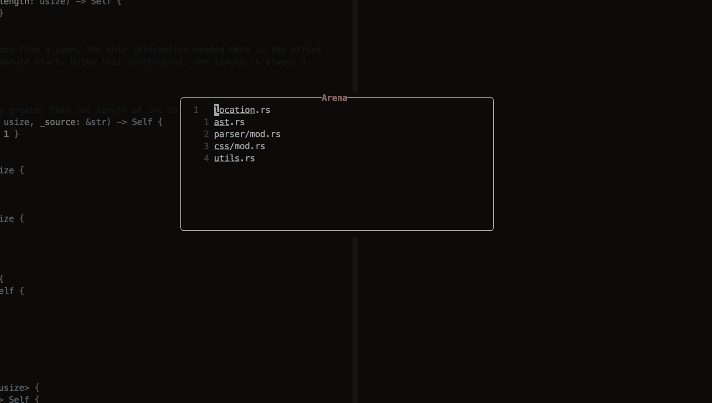

# arena.nvim

`arena.nvim` is a [frecency](https://en.wikipedia.org/wiki/Frecency)-based
buffer switcher that allows you to hop between files _as fast as you can think_!
It sorts your buffers both by their recency of use, as well as their overall
usage!

If you're tired of:

- Using a fuzzy-finder every time you want to switch to a file
- Persistent marks that you have to maintain yourself
- Feeling completely lost in projects with a lot of files

then the arena the perfect solution!


<sub>The arena window. You can jump to your most frecent files!</sub>

## Getting Started

You can use your favorite package manager to get `arena.nvim` on your system.

For example, with [lazy](https://github.com/folke/lazy.nvim):

```lua
{
  "dzfrias/arena.nvim",
  event = "BufWinEnter",
  -- Calls `.setup()` automatically
  config = true,
}
```

Or with [packer](https://github.com/wbthomason/packer.nvim):

```lua
use {
  "dzfrias/arena.nvim",
  config = function()
    require("arena").setup()
  end
}
```

To see if everything's working, restart neovim and run `:ArenaToggle`! From
here, you can see the [config reference](#configuration) or the
[API reference](#api) for the full breadth of options!

## Default Keybinds

`arena.nvim` comes with some default keybinds for buffer management!

| Key     | Description                        |
| ------- | ---------------------------------- |
| `<CR>`  | Open to file                       |
| `d`     | Delete the buffer under the cursor |
| `D`     | Delete all unpinned buffers        |
| `p`     | Pin the buffer under the cursor    |
| `<C-v>` | Open file (vsplit)                 |
| `<C-x>` | Open file (hsplit)                 |
| `<C-t>` | Open file (tab)                    |

If you'd like to unset any of these, set the value to `nil` in the keybinds
section of the [config](#configuration).

## Configuration

`arena.nvim` has plenty of configuration options to suit your needs! Below are
all the configuration options along with their default values.

```lua
{
  -- Maxiumum number of files that the arena window can contain, or `nil` for
  -- an unlimited amount
  max_items = 5,
  -- Always show the enclosing folder for these paths
  always_context = { "mod.rs", "init.lua" },
  -- When set, ignores the current buffer when listing files in the window.
  ignore_current = false,
  -- Options to apply to the arena buffer.
  -- Format should be `["<OPTION>"] = <VALUE>`
  buf_opts = {
    -- Example. Uncomment to add to your config!
    -- ["relativenumber"] = false,
  },
  -- Filter out buffers per the project they belong to.
  per_project = false,
  --- Add devicons (from nvim-web-devicons, if installed) to buffers
  devicons = false,


  window = {
    width = 60,
    height = 10,
    border = "rounded",

    -- Options to apply to the arena window.
    opts = {},
  },

  -- Keybinds for the arena window.
  keybinds = {
      -- Example. Uncomment to add to your config!
      -- ["e"] = function()
      --   vim.cmd("echo \"Hello from the arena!\"")
      -- end
  },

  -- Change the way the arena listing looks with custom rendering functions
  renderers = {}

  -- Config for frecency algorithm.
  algorithm = {
    -- Multiplies the recency by a factor. Must be greater than zero.
    -- A smaller number will mean less of an emphasis on recency!
    recency_factor = 0.5,
    -- Same as `recency_factor`, but for frequency!
    frequency_factor = 1,
  },
}
```

## API

`arena.nvim` has both a lua and vim API for more involved usages.

### Toggle

Toggles the arena window. `ArenaToggle` from vimscript.

```lua
require("arena").toggle()
```

### Open

Opens the arena window. `ArenaOpen` from vimscript.

```lua
require("arena").open()
```

### Close

Closes the arena window, if it exists. `ArenaClose` from vimscript.

```lua
require("arena").close()
```

### Action

Useful in the `keybinds` key of [the config](#configuration). Wraps a function
that should do something with the currently selected file in the arena window.

The function is passed a number, which represents the buffer number of the
currently selected file. It can also accept a second argument, which is the
output of `getbufinfo()`.

```lua
-- Equivalent to the <C-v> keybind in the arena window
require("arena").action(function(bufnr, info)
  vim.cmd({
    cmd = "split",
    args = { vim.fn.bufname(bufnr) },
    mods = { vertical = true },
  })
  vim.fn.cursor(info.lnum, 0)
end)
```

There is a variant of `action`: `action_all`. This is the same as `action`,
except it will apply to each buffer in the window.

```lua
-- Close all buffers in the window
require("arena").action_all(function(bufnr)
  require("arena").remove(bufnr)
end)
```

Most keybinds are implemented as actions in the source code, so
[check those out](https://github.com/dzfrias/arena.nvim/blob/f9268d7f0b30c93e592a87a24257956f1bb868ac/lua/arena/init.lua#L69)
if you want real examples!

### Remove

Remove a buffer from the arena window, by buffer number, useful in
[actions](#action). The buffer will also be deleted in vim (like `:bdelete`).

```lua
-- Remove the 42nd buffer from the arena window
require("arena").remove(42)
```

### Pin

Pin a buffer to the top of the arena window. Useful in [actions](#action).

```lua
-- Pin the 43rd buffer
require("arena").pin(43)
```

You may check if a buffer is pinned using the `is_pinned(buf)` function.

### Refresh

Refresh the arena window. Useful in [actions](#action)!

```lua
require("arena").refresh()
```

## License

The plugin falls under the [MIT License](./LICENSE).
